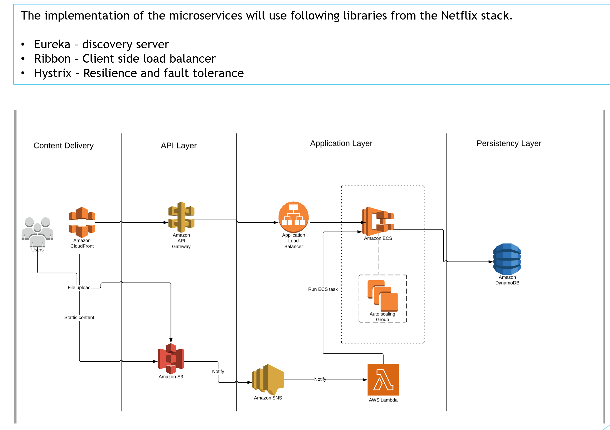

# timesheet-management-aws-deploy
Deploying Microservices on AWS Cloud

# Problem Statement

=== Business Requirements
* A new starter business a timesheet management application that will be used by end users for following actions 
* Users should be able to login to the application
* Users will upload the timesheet data in excel format
* Administrators can view the uploaded timesheet in user friendly format

=== Technical Requirements
* The application needs to support following technical requirements
* The application should follow DDD and microservices architecture 
* The application should use the Netflix stack and should be hosted on AWS
* The data should be stored in JSON format in the database (DynamoDB)

# Solution

=== Context Map

The following diagram shows the DDD for the problem statement. This is the context map for the problem statement that shows the domain and subdomain.

image::./images/domain_context_map.PNG[]

=== Logical Architecture

The following diagram shows the logical architecture of the application. 
The microservices in this architecture is layered by purpose (systems, processes (or domain models) and experience). The complexity of the architecture can be managed easily.

image::./images/Timesheet_Management_Logical_Architecture.PNG[]

=== Technical Architecture (AWS)

This repo contains an application that consists of microservices. The application uses following services:

* auth-service: Microservice for managing authentication & autherization in the application.
* visualize-timesheet-service: A microservice that returns timesheet data for users.
* process-timesheet: A microservice that processes the timesheet uploaded by the users in excel format.
* user-service: A microservice that performs user level operations like add user, update user, delete user etc.
* project-service: A microservice that performs project level operations like add project, add user to project etc.
* discovery-server: Eureka discovery server for discovery of microservices.

Each microservice can be deployed using different AWS Compute options.

# Build and Test Services using Maven

All the microservices code in the following repo:

https://github.com/surenzhy/timesheet-management-micorservices-app

### run discovery-server
  
  
### run auth-service

  
### run visualize-timesheet-service

### run process-timesheet

### run user-service

### run project-service

